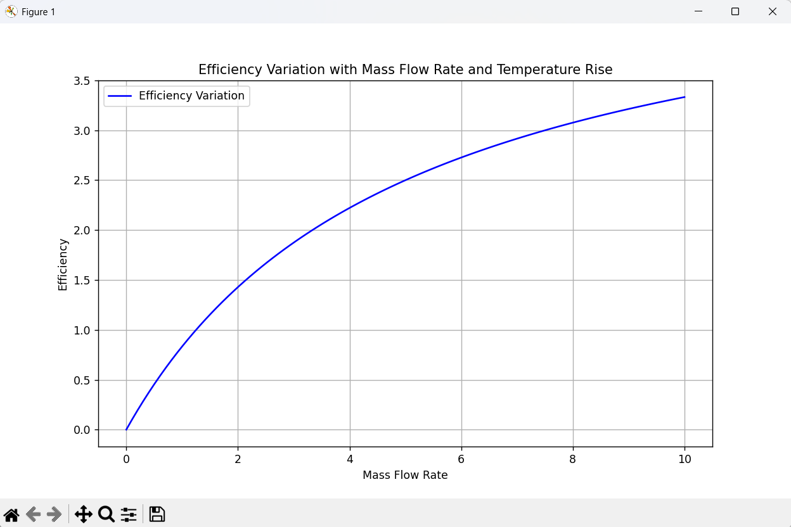

# Reactor Thermal-Hydraulic Analysis

## Overview

This project models the thermal behavior of a nuclear reactor cooling system by analyzing heat removal as a function of coolant flow rate. It demonstrates the importance of thermal-hydraulic design in maintaining reactor safety and efficiency.

---

## Objectives

* Calculate heat removal from reactor core
* Analyze effect of coolant mass flow rate
* Understand thermal performance of reactor cooling systems
* Visualize heat transfer behavior

---

## Theory

Heat removal by coolant is given by:

Q = m × c × ΔT

Where:

* Q = Heat transfer rate (W)
* m = Mass flow rate (kg/s)
* c = Specific heat capacity (J/kg·K)
* ΔT = Temperature rise (K)

---

## Methodology

* Assumed water as coolant
* Defined a range of mass flow rates
* Calculated heat removal using thermodynamic relation
* Plotted variation of heat removal with flow rate

---

## Results

### Sample Calculation

* At 500 kg/s → Heat removed ≈ 63 MW

---

## Visualization



---

## Key Insights

* Heat removal increases linearly with coolant flow rate
* Higher flow rates improve reactor cooling efficiency
* Thermal management is critical for reactor safety

---

## Tools Used

* Python
* NumPy
* Matplotlib

---

## How to Run

```bash
pip install -r requirements.txt
python src/main.py
```

---

## Applications

* Reactor cooling system design
* Thermal safety analysis
* Nuclear power plant operation

---

## Future Work

* Include different coolants (liquid sodium, helium)
* Add transient heat transfer analysis
* Integrate with reactor core temperature modeling

---

## Author

Shivang Arora
Energy Engineering Student | Nuclear Energy Enthusiast

